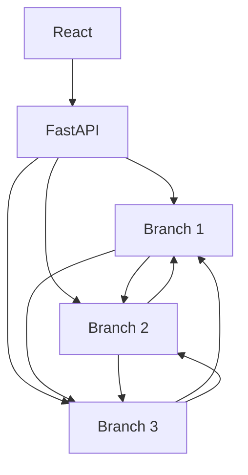

# Distributed Banking System

A small distributed banking system built to demonstrate the core mechanics of a
replicated service: independent nodes, inter-service RPC, synchronous
replication, and idempotent writes. Three bank **Branch** servers each keep
their own local SQLite database and a FastAPI **Gateway** fronts them for a
React dashboard.

## Overview

This project demonstrates:

- **Distributed service communication** — three independent Branch servers,
  each with its own database, coordinated over gRPC.
- **gRPC** — a single `.proto` contract defines every client-facing and
  inter-branch operation.
- **Replicated branch state** — a successful write on one branch is pushed
  synchronously to the other two, so all three branches converge on the same
  balance.
- **Transaction idempotency** — every write carries a client-supplied
  `transaction_id`; replaying it (as a client retry or a replication message)
  returns the original result instead of applying the change twice.
- **Database transactions** — a transfer's debit and credit happen in one
  local SQLAlchemy transaction, so they succeed or fail together.
- **Simple failure handling** — if a replica is unreachable, the originating
  branch still commits and reports which peers succeeded and which failed.
  No retries, no consensus protocol — just an honest status report.

This project intentionally leaves out Kafka, Redis, Kubernetes, auth, Raft/Paxos,
and two-phase commit. The goal is a system whose entire design fits in a
5-minute whiteboard explanation.

## Architecture



- **React (Vite)** talks to the **FastAPI Gateway** over HTTP only.
- The **Gateway** never touches a Branch database directly — every read and
  write goes through gRPC to the relevant Branch.
- Each **Branch** (ports `50051` / `50052` / `50053`) owns a private SQLite
  database. After a branch commits a deposit, withdrawal, or transfer
  locally, it replicates the completed transaction to the other two branches
  via `ReplicateTransaction`. A replicated write is applied once and never
  re-replicated, so there's no cascading loop.

### Why this counts as "distributed"

Each branch is a fully independent process with its own database and its own
source of truth — there is no shared database and no central coordinator
deciding outcomes. A transaction is decided locally by whichever branch
receives it, then propagated to the others as a fact, which is the same
push-based replication model used by real multi-region datastores (minus the
consensus algorithm, intentionally, to keep the demo legible).

## Tech Stack

| Layer          | Technology                                   |
|----------------|-----------------------------------------------|
| Branch servers | Python 3, gRPC, Protocol Buffers, SQLAlchemy, SQLite |
| Gateway        | Python 3, FastAPI                            |
| Frontend       | React, Vite, plain CSS                       |
| Tests          | pytest                                       |
| Infrastructure | Docker, Docker Compose                       |

## Project Structure

```text
distributed-banking-system/
├── backend/
│   ├── proto/banking.proto          gRPC service + message definitions
│   ├── generated/                   protoc-generated client/server code
│   ├── branch/
│   │   ├── server.py                gRPC server entry point
│   │   ├── service.py               deposit/withdraw/transfer/replication logic
│   │   ├── database.py              per-branch SQLite engine + seeding
│   │   └── models.py                SQLAlchemy models (Account, Transaction)
│   ├── gateway/
│   │   ├── main.py                  FastAPI REST endpoints
│   │   ├── grpc_client.py           gRPC clients to the branches
│   │   └── schemas.py               Pydantic request/response models
│   ├── shared/config.py             branch ports, hosts, seed balances
│   └── tests/                       pytest suite
├── frontend/
│   └── src/                         React dashboard (Vite + plain CSS)
├── docker-compose.yml
├── requirements.txt
└── README.md
```

## Data Model

Balances are stored as **integer cents** everywhere — never floating point.
`$10.50` is stored as `1050`.

**Account**

| column      | type    |
|-------------|---------|
| account_id  | int PK  |
| balance     | int (cents) |
| updated_at  | datetime |

**Transaction**

| column         | type                              |
|----------------|------------------------------------|
| transaction_id | string, **unique**                |
| type           | `DEPOSIT` \| `WITHDRAW` \| `TRANSFER` |
| from_account   | int, nullable                     |
| to_account     | int, nullable                     |
| amount         | int (cents)                       |
| status         | `SUCCESS` \| `FAILED`             |
| origin_branch  | int                                |
| created_at     | datetime                          |

Seed data (identical on all three branches at startup):

| Account | Balance   |
|---------|-----------|
| 1       | $1,000.00 |
| 2       | $2,000.00 |
| 3       | $500.00   |

## Idempotency

Every write RPC — client-facing and inter-branch — carries a
`transaction_id`. Before applying a change, a branch checks whether that
`transaction_id` already exists:

- **First time seen** → execute the operation, store the result.
- **Seen before** → return the stored result unchanged. The balance is not
  touched a second time.

Because `transaction_id` is the primary key on the `transactions` table, this
also holds up under concurrent duplicate requests. The same check runs for
both a client retry (`Deposit`/`Withdraw`/`Transfer`) and a replicated write
(`ReplicateTransaction`), which is what stops replication from ever looping
back between branches.

## Replication

Replication is **synchronous** and **best-effort**:

1. A branch commits a transaction to its own database.
2. It calls `ReplicateTransaction` on the other two branches, in-line,
   before responding to the caller.
3. The response reports exactly what happened:

```json
{
  "transaction_id": "tx-1003",
  "status": "SUCCESS",
  "replicated_to": [2],
  "failed_replicas": [3]
}
```

If a replica is down, the originating branch's transaction still succeeds —
it just reports that replica in `failed_replicas`. There's no retry queue or
background reconciliation; that complexity is deliberately out of scope.

A branch receiving a `ReplicateTransaction` call applies it locally and
**does not** re-replicate it, which is what keeps replication from cascading
between branches.

## Running Locally (Docker)

```bash
docker compose up --build
```

This starts `branch1` (`:50051`), `branch2` (`:50052`), `branch3` (`:50053`),
`gateway` (`:8000`), and `frontend` (`:3000`).

Open **http://localhost:3000** for the dashboard, or hit the API directly at
**http://localhost:8000**.

## Running Locally (without Docker)

```bash
pip install -r requirements.txt

# in three separate terminals
python -m backend.branch.server 1
python -m backend.branch.server 2
python -m backend.branch.server 3

# in a fourth terminal
uvicorn backend.gateway.main:app --port 8000

# in a fifth terminal
cd frontend
npm install
npm run dev
```

## API Reference (Gateway)

| Method | Path                              | Description                          |
|--------|------------------------------------|---------------------------------------|
| GET    | `/api/branches`                   | List available branches               |
| GET    | `/api/accounts?branch_id=1`       | List all account balances on a branch |
| GET    | `/api/accounts/{account_id}?branch_id=1` | Balance of one account on a branch |
| GET    | `/api/transactions?branch_id=1`   | Recent transactions on a branch       |
| POST   | `/api/deposit`                    | Deposit into an account               |
| POST   | `/api/withdraw`                   | Withdraw from an account              |
| POST   | `/api/transfer`                   | Transfer between two accounts         |

## Tests

```bash
pytest backend/tests/
```

Covers:

1. Deposit updates the balance.
2. Withdraw is rejected for insufficient funds.
3. Transfer debits one account and credits another in a single local
   transaction.
4. A duplicate `transaction_id` executes only once.
5. A successful transaction replicates to another branch.
6. Duplicate replication does not update a branch twice.

## Demo

The frontend is built around this walkthrough:

1. **Transfer through Branch 1** — select *Branch 1*, submit a Transfer of
   $100 from Account 1 to Account 2. Branch 1's balances update immediately.
2. **Verify through Branch 2** — switch the *Viewing Branch* dropdown to
   *Branch 2*. The same updated balances appear, because Branch 1 replicated
   the transaction to Branch 2 (and Branch 3) synchronously before returning.
3. **Resend the same transaction** — click **Simulate Duplicate Request**,
   which resends the exact same request (same `transaction_id`) that was
   just submitted.
4. **Verify nothing changed twice** — the UI shows *"Duplicate transaction
   detected. Existing result returned. Balance was not changed."* and the
   account balances are unchanged from step 2.

## UI

A single dashboard page: a branch selector, account balance cards, a
transaction form that shows only the fields relevant to the selected
operation type, a recent transactions table, and the duplicate-request demo
button described above.
